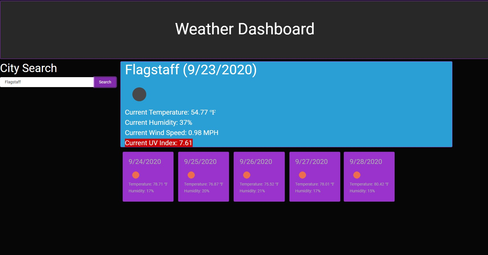

# What This Is
This is a weather dashboard that displays weather information about a searched city. It first has the user input a city name, and search. The largest display is the current weather of that city. It will give temperature in fahrenheit, humidity, wind speed, and the UV index. The UV index display will change color to give a representation of how cautious the user should be based on how high that is. There will also be the date and an icon to represent the sky. The next area will provide a forecast for the next five days in that city. It, too, will display the date and an icon, but the only weather conditions it will give are the temperature and the humidity. 

# How It Is Done
The first thing I did was create the html elements that I would use to call in my javascript. I made sure there was an area for every display I wanted to update as I got data from the AJAX call. The search button actual does two AJAX calls. The first is from the API from openweathermap.org. I first pull two main data points, the name of the city, and the coordinates. The name is a little redundant because the user inputs it. The reason I did it was so that the function will only return it, if its something the API has as a data point. The reason I pull the coordinates is because there is a one call API that provides the current weather data, including the UV index, as well as a multiple day forecast, but will only work if it has the longitude and latitude. I use this one call API to then pull all the data I need then attach it to the html elements I created.  

# Struggles 
I had two big struggles with this project. The first was utilizing the correct APIs. This was a struggle mainly because I had to look through and research all the documentation to get the correct information. It wasn't until I got it fully working that I knew it was the right path. The other big struggle I had was displaying previous searched cities. I have a function in the code that sets local storage to take an empty array. As the user enters cities, it is supposed to push those inputs into the array, then when the search button is clicked, it should create a list item that then will be appended to an unordered list element. I would very much like this to work and I brought it up to the team but I don't think I brought it up with enough time. 

# The Application 

